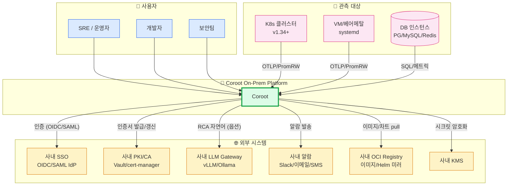
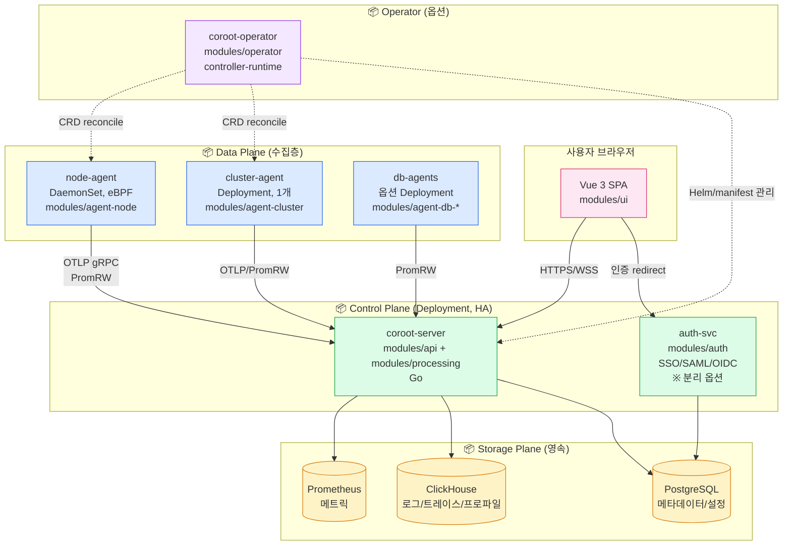
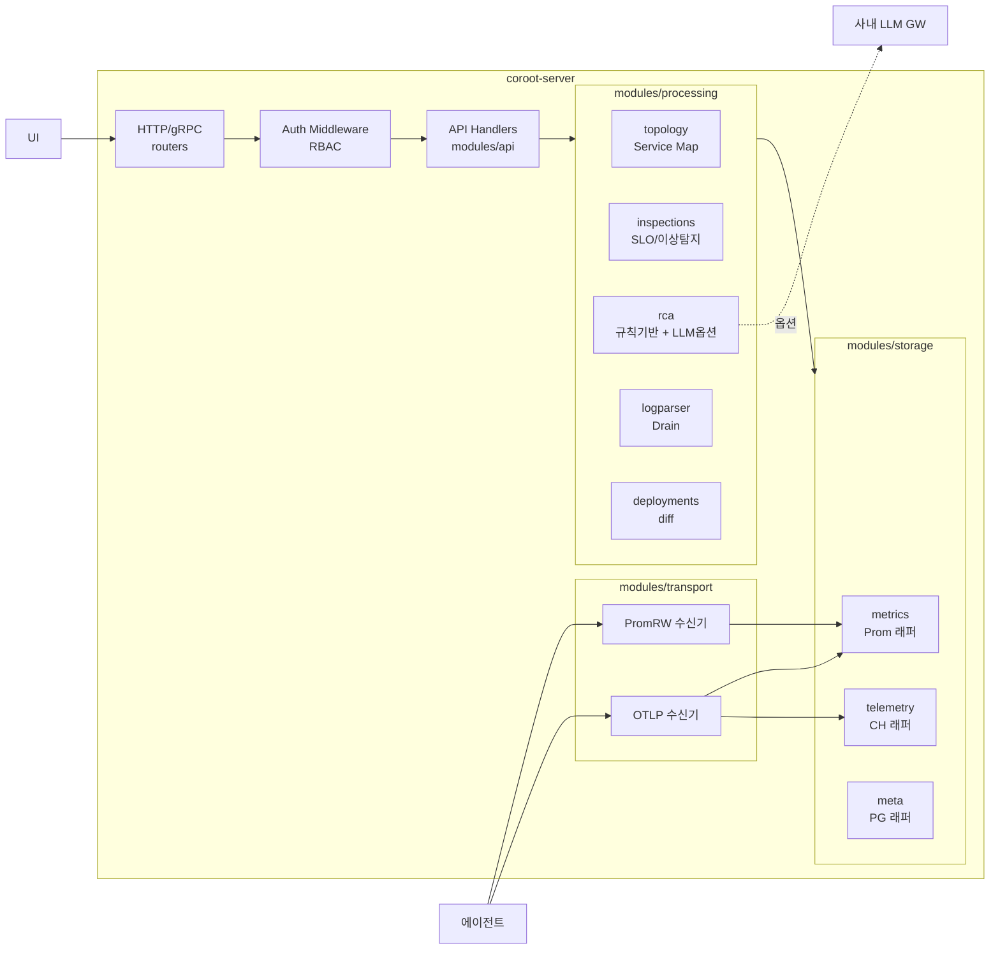
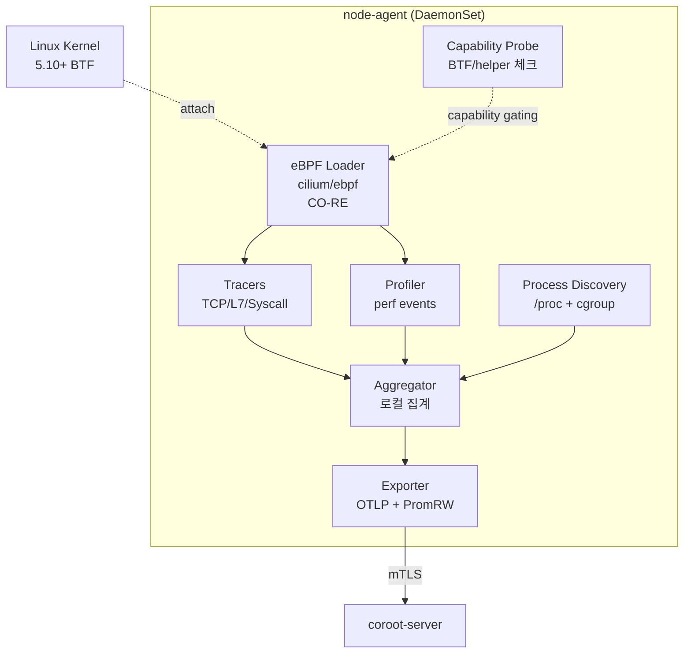
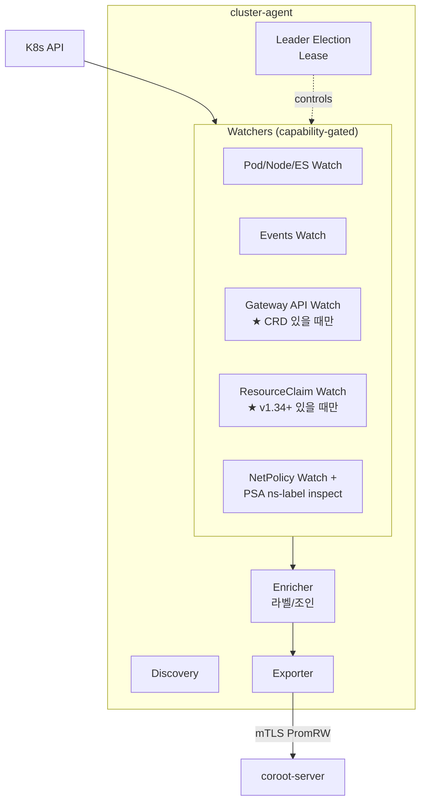
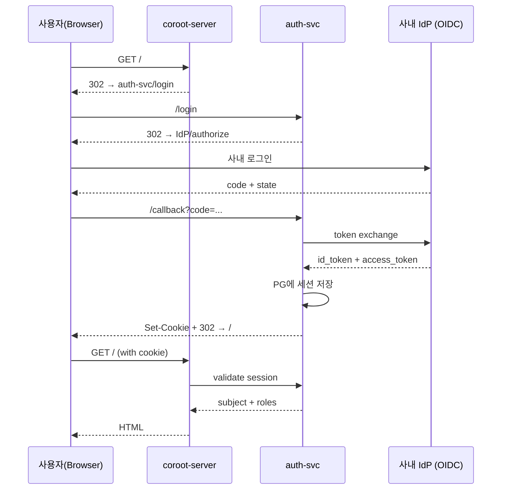
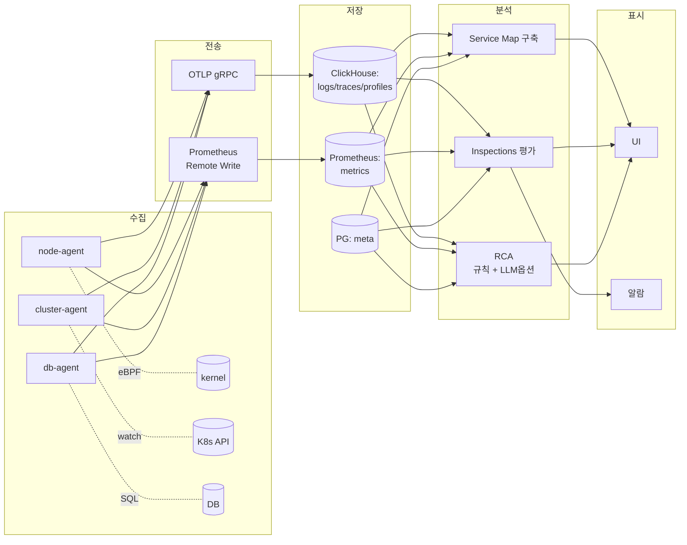

# 01. 시스템 아키텍처

> **문서 종류**: 시스템 전체 아키텍처 (Architecture Overview)
> **작성일**: 2026-05-18
> **상태**: Draft v0.1
> **독자**: 모든 AI 에이전트, 개발자, SRE, 운영팀
> **권한**: 본 문서는 **시스템 그림의 단일 출처(Single Source of Truth)**. 다른 문서와 충돌 시 본 문서를 우선.

> **사용 방법**: 코드 작업 시작 전 본인이 만질 컴포넌트의 위치를 확인하고, 의존하는 컨테이너/모듈을 식별한 뒤 시작할 것. 컴포넌트 경계를 침범하는 변경은 본 문서 수정과 함께 진행.

---

## 0. 한 줄 요약

**eBPF 기반 zero-instrumentation 수집기 + ClickHouse/Prometheus 저장소 + Go 분석 엔진 + Vue UI**로 구성된 **On-Premise Kubernetes 옵저버빌리티 플랫폼**. 외부 SaaS 의존 없음, 사내 SSO/PKI/Vault 연동, K8s v1.34+ 및 VM/베어메탈 동시 지원.

---

## 1. Level 1 — System Context (시스템 경계)

### 1.1 컨텍스트 다이어그램



### 1.2 경계 규칙

| 카테고리 | 항목 |
|---|---|
| **시스템 내부** | 본 프로젝트의 모든 `modules/*` 코드, 자체 운영 DB(메타데이터), 자체 ClickHouse/Prometheus 인스턴스 |
| **사내망 의존 (필수)** | 사내 SSO, 사내 PKI/CA, 사내 OCI Registry, 사내 NTP |
| **사내망 의존 (옵션)** | 사내 LLM GW (없으면 규칙 기반 RCA), 사내 KMS (없으면 etcd KMS v2 단독), 사내 알람 |
| **외부 인터넷** | 평시 사용 안 함. 부트스트랩/업그레이드 시에만 사내 미러 경유 |
| **관측 대상** | 본 시스템과 통신 가능한 K8s 클러스터(v1.34+) 및 VM 그룹 |

### 1.3 행위자(Actor)와 책임

| 행위자 | 역할 | 주요 사용 화면 |
|---|---|---|
| **SRE/운영자** | 장애 감지·진단, SLO 운영, 알람 룰 관리 | Service Map, Inspections, SLO 대시보드 |
| **개발자** | 서비스 코드 변경 영향 확인, 트레이스·프로파일 분석 | Trace Viewer, Profile, Deployment Diff |
| **보안팀** | 정책 위반 감사, 비정상 트래픽 분석 | Audit View, NetworkPolicy 분석 |

---

## 2. Level 2 — Container (배포 단위)

### 2.1 컨테이너 다이어그램



### 2.2 컨테이너 책임 매트릭스

| 컨테이너 | 모듈 경로 | 배포 형태 | 책임 | 외부 의존 | HA 전략 |
|---|---|---|---|---|---|
| **coroot-server** | `modules/api` + `modules/processing` | Deployment (≥2 replicas) | API, 분석 엔진, UI 정적 자산 서빙 | PG, CH, Prom | active-active (PG로 락 조정) |
| **coroot-ui** (옵션 분리) | `modules/ui` | Deployment | Vue SPA 정적 호스팅 (server 임베드도 가능) | — | 임의 |
| **auth-svc** | `modules/auth` | Deployment (또는 server 임베드) | SSO redirect, 세션, RBAC | 사내 IdP, PG | active-active |
| **node-agent** | `modules/agent-node` | **DaemonSet** | eBPF 수집 (네트워크/L7/시스템) | kernel BTF, bpffs | per-node, host-network |
| **cluster-agent** | `modules/agent-cluster` | Deployment (1 replica, leader election) | K8s 리소스/이벤트 watch, Gateway API, DRA | K8s API | Lease 기반 leader |
| **db-agents** | `modules/agent-db-*` | Deployment (DB당 1개) | DB 메트릭 수집 (옵션) | 대상 DB | — |
| **operator** | `modules/operator` (코드) + `deploy/operator/` (매니페스트) | Deployment | CRD reconcile, 자동 업그레이드 | K8s API | leader election |
| **Prometheus** | (외부 컴포넌트) | StatefulSet / 외부 클러스터 | 메트릭 저장 | — | 사내 표준 |
| **ClickHouse** | (외부 컴포넌트) | StatefulSet / 외부 클러스터 | 로그/트레이스/프로파일 저장 | — | 사내 표준 |
| **PostgreSQL** | (외부 컴포넌트) | StatefulSet / 외부 클러스터 | 메타데이터/설정/세션 | — | 사내 표준 |

> **명명 규약 명확화**:
> - `modules/operator/` = Operator의 **Go 코드** (reconciler, controllers, webhooks)
> - `deploy/operator/` = Operator 배포에 필요한 **K8s 매니페스트/Helm/Kustomize**
> - 두 디렉터리 모두 존재 (CLAUDE.md §3 디렉터리 트리에 반영 완료)

### 2.3 컨테이너 간 통신 매트릭스

| From → To | 프로토콜 | 인증 | 방향 | 비고 |
|---|---|---|---|---|
| Browser → coroot-server | HTTPS (TLS 1.3) | 세션 쿠키 (HttpOnly, Secure) | client→server | mTLS는 미적용 (사용자 브라우저) |
| Browser → auth-svc (분리 모드) | HTTPS | OIDC redirect | client→server | **embed 모드에서는 coroot-server가 동일 엔드포인트 처리** |
| node-agent → coroot-server | OTLP gRPC + PromRW HTTPS | **mTLS** (사내 CA) | client→server | 에이전트가 client |
| cluster-agent → coroot-server | OTLP gRPC + PromRW HTTPS | **mTLS** | client→server | |
| **coroot-server → Prometheus** | **PromRW (write)** + **HTTP/PromQL (read)** | TLS + (basic auth 옵션) | client→server | **수신한 메트릭은 PromRW로 write, UI 조회는 PromQL로 read** |
| coroot-server → ClickHouse | Native TCP | 사용자/비번 + TLS | client→server | write/read 양방향 |
| coroot-server → PG | TCP (libpq) | 사용자/비번 + TLS | client→server | meta DB |
| coroot-server → 사내 LLM GW (옵션) | HTTPS | 사내 토큰 | client→server | RCA 자연어 |
| coroot-server → 사내 Alarm GW | HTTPS | 사내 토큰 | client→server | 알람 발송 |
| operator → K8s API | HTTPS | ServiceAccount Token | client→server | |
| cluster-agent → K8s API | HTTPS | ServiceAccount Token | client→server | read-only 최소권한 |

> **인증 모드 분기 (auth-svc embed vs 분리)**:
> - **Embed 모드 (기본)**: `coroot-server` 바이너리에 auth 핸들러 포함 → 브라우저는 `coroot-server` 한 곳과만 통신
> - **분리 모드**: auth-svc를 별도 Deployment로 운영 → OIDC redirect 경로가 `auth-svc` 도메인
> - 선택은 `Coroot` CRD 또는 Helm values의 `auth.deployment: embedded | separated`로 결정

---

## 3. Level 3 — Component (모듈 내부 구조)

### 3.1 coroot-server 내부 컴포넌트



### 3.2 node-agent 내부 컴포넌트



### 3.3 cluster-agent 내부 컴포넌트



### 3.4 모듈 의존성 규칙 (Layering)

```
┌─────────────────────────────────────────────────────────┐
│ Presentation: ui                                         │
└───────────────┬─────────────────────────────────────────┘
                │ HTTPS
┌───────────────▼─────────────────────────────────────────┐
│ API: api + auth                                          │
└───────────────┬─────────────────────────────────────────┘
                │
┌───────────────▼─────────────────────────────────────────┐
│ Processing: topology, inspections, rca, logparser        │
└───────────────┬─────────────────────────────────────────┘
                │
┌───────────────▼─────────────────────────────────────────┐
│ Storage adapters: metrics, telemetry, meta               │
└───────────────┬─────────────────────────────────────────┘
                │
┌───────────────▼─────────────────────────────────────────┐
│ Transport: otlp, promrw  (수집 진입점)                   │
└─────────────────────────────────────────────────────────┘

Agents (별도 프로세스):
- agent-node (eBPF)
- agent-cluster (K8s API)
- agent-db-* (DB 직결)
   →→→ 모두 Transport 계층으로 Push
```

**규칙**:
- 상위 계층만 하위 계층을 참조. 역방향 금지.
- 같은 계층 내 모듈끼리 직접 import 가능 (예: topology ↔ inspections).
- `pkg/*` 는 모든 계층에서 참조 가능.
- 에이전트는 server를 직접 import 하지 않음. **contracts/proto/openapi**만 공유.

---

## 4. Level 4 — Deployment View (On-Prem 특화)

### 4.1 표준 배포 모드 3종

#### 모드 A — K8s 단일 클러스터 (가장 권장)
```
┌─ K8s Cluster (v1.34+) ──────────────────────────────────┐
│                                                          │
│  ns: coroot-system                                       │
│  ├─ coroot-server (Deployment ×2, HA)                    │
│  ├─ coroot-ui (옵션 분리 또는 server 임베드)              │
│  ├─ coroot-operator (Deployment ×1, leader)              │
│  ├─ prometheus (StatefulSet)                             │
│  ├─ clickhouse (StatefulSet ×3, replicated)              │
│  └─ postgres (StatefulSet ×1, with backup)               │
│                                                          │
│  ns: coroot-agents                                       │
│  ├─ node-agent (DaemonSet, every node)                   │
│  ├─ cluster-agent (Deployment ×1)                        │
│  └─ db-agents (옵션)                                      │
│                                                          │
│  관측 대상 ns: app-* / kube-system / istio-system 등     │
└──────────────────────────────────────────────────────────┘
```

#### 모드 B — K8s + VM 혼합 (사내 흔한 패턴)
```
┌─ K8s Cluster ──────┐         ┌─ VM Fleet (systemd) ────┐
│ coroot-server +    │ ◄──── │ node-agent.service       │
│ storage stack      │ mTLS  │ (no K8s, /var/lib 기반)  │
│ cluster-agent      │       └──────────────────────────┘
└────────────────────┘
```
- VM의 node-agent는 K8s 없이 systemd unit으로 배포 (`deploy/systemd/`)
- 서비스 디스커버리는 정적 파일 또는 사내 자체 inventory 연동
- 동일한 mTLS 인증서, 동일한 OTLP/PromRW로 server에 push

#### 모드 C — Air-gapped K8s (완전 폐쇄망)
```
┌─ Air-gap Boundary ─────────────────────────────────────┐
│                                                         │
│  사내 OCI Registry ◄── 외부에서 미리 sync (사람 매개)    │
│         │                                               │
│         ▼                                               │
│  Helm Charts (사내 helm repo) ─► K8s Cluster           │
│                                                         │
│  ⚠ 외부 API 호출 0건                                    │
│  ⚠ LLM RCA = 사내 vLLM/Ollama only                      │
│  ⚠ 이미지 서명 검증 (cosign + 사내 키)                   │
└─────────────────────────────────────────────────────────┘
```

### 4.2 노드/리소스 권장 사양 (1차 추정)

| 컴포넌트 | CPU | 메모리 | 디스크 | 비고 |
|---|---|---|---|---|
| coroot-server (replica당) | 1~2 vCPU | 2~4 GiB | — | API + 분석 |
| node-agent (per node) | 50~200 mCPU | 128~512 MiB | bpffs mount | eBPF |
| cluster-agent | 200 mCPU | 256 MiB | — | watch 부하 |
| Prometheus | 2~8 vCPU | 4~16 GiB | 100 GiB+ (보관기간 종속) | 사내 표준 따름 |
| ClickHouse (replica당) | 4~16 vCPU | 16~64 GiB | 500 GiB+ | TTL/parts 정책 필수 |
| PostgreSQL | 1~2 vCPU | 1~2 GiB | 10 GiB | 메타만 |

> 정확한 사양은 노드 수, 트래픽, 데이터 보존 기간에 따라 별도 사이징 가이드 필요 (`docs/40-runbooks/sizing-guide.md` — 향후).

### 4.3 네트워크 토폴로지 권장

- **에이전트 ↔ 서버**: 별도 ingress/gateway 경유 가능. 권장 도메인 `coroot-ingest.<사내>.kr` (mTLS)
- **UI ↔ 서버**: 사내 Ingress + TLS, 사내 SSO redirect
- **NetworkPolicy 베이스라인**: 에이전트는 server outbound만, server는 storage outbound + IdP/LLM/Alarm만
- **사내 `NO_PROXY`** 필수: `cluster.local`, Pod CIDR, Service CIDR

---

## 5. 횡단 관심사 (Cross-cutting)

### 5.1 인증/인가 흐름 (SSO)



- **RBAC**: role-based, 사내 IdP의 그룹을 role에 매핑
- **다중 IdP**: 옵션 — 일반 사용자(OIDC) + admin(SAML) 등

### 5.2 시크릿/PKI 흐름

- **에이전트 인증서**: `cert-manager` + 사내 CA(Vault) → 자동 발급/갱신 (24h 단위)
- **서버 인증서**: 사내 CA 발급 + 자동 갱신
- **시크릿**: K8s Secret (KMS v2 etcd 암호화) → 가능한 경우 사내 Vault Inject
- **에이전트 첫 가입(Onboarding)**: CSR 기반 부트스트랩 토큰 (단기, 1회용)

### 5.3 데이터 흐름 (Telemetry Pipeline)



### 5.4 자기 관측 (Self-Observability)

- 자기 자신의 메트릭은 `coroot_*` 프리픽스로 자기 Prom에 노출 (eat your own dogfood)
- 자체 트레이스는 자체 ClickHouse로 — 단, 무한 루프 방지를 위해 sampling 강제 (1%)
- 자체 로그는 stdout (사내 log shipper가 별도 수집)

### 5.5 자기 보호 (Self-Preservation)

- **디스크 사용량 임계**: ClickHouse 85% 도달 시 수집 제한 모드, 95% 도달 시 수신 중단(에이전트로 backoff 신호)
- **메모리 한도**: 각 컨테이너 OOMKill 회피용 자체 GC + slog 경고
- **Cardinality 한도**: 메트릭 라벨당 unique 값 한도(예: 10만) 초과 시 라벨 드롭 + 알람

### 5.6 Capability 기반 기능 게이팅 (★중요)

> **원칙**: K8s 신규 기능(Gateway API, DRA 등)은 **API discovery로 확인 후 활성화**. 결코 hard requirement로 두지 않음.

| 기능 | Capability 체크 방법 | Fallback |
|---|---|---|
| Gateway API | `gateway.networking.k8s.io/v1` CRD 존재 | `networking.k8s.io/v1 Ingress` 사용 |
| DRA | `resource.k8s.io/v1` API 존재 | device plugin + DCGM Exporter 수집 |
| In-place Pod Resize | `pods/resize` 서브리소스 응답 | 재시작 기반 리사이즈 |
| ValidatingAdmissionPolicy | API 존재 확인 | webhook 기반 정책 또는 비활성 |
| Structured Authorization | kube-apiserver flag 확인 (관측만) | 기존 RBAC만 |
| OTel Profiles signal | (signal 자체가 alpha — 도입 보류) | **Pyroscope 호환 포맷 또는 pprof 자체 포맷** (상세: coroot-mapping.md T3) |
| eBPF fentry/fexit | kernel BTF + 함수 존재 확인 | kprobe fallback |

---

## 6. 핵심 의사결정 요약 (DECISIONS)

| # | 결정 | 사유 | 관련 ADR |
|---|---|---|---|
| D1 | Go + Vue 스택 | Coroot 생태계와 동일 스택 → 공식 docs/예제 직접 참조 가능 (코드 카피 X — ADR-0003) | ADR-0003 |
| D2 | K8s v1.34 minimum, v1.36 primary | DRA/In-place Resize GA 활용 균형 | ADR-0001 |
| D3 | Storage: Prom + ClickHouse + PG | 신호별 최적 저장소 | — |
| D4 | mTLS 강제 (에이전트↔서버) | On-Prem 보안 표준 | — |
| D5 | 사내 SSO만 (로컬 계정 불가) | 사내 정책 준수 | — |
| D6 | RCA = 규칙 기반 1차 + 사내 LLM 옵션 | 외부 LLM 직접 호출 금지 | — |
| D7 | eBPF는 cilium/ebpf (CO-RE) | bcc 회피, 운영 단순화 | — |
| D8 | 신규 K8s 기능은 capability gating | 클러스터 다양성 수용 | — |
| D9 | UI는 server 임베드 (기본) | 배포 단순화. 분리는 옵션 | — |
| D10 | Operator는 옵션 (Helm only 모드도 지원) | 사내 보수 환경 호환 | — |

---

## 7. 비기능 요구사항 (NFR)

| 분류 | 목표 |
|---|---|
| **가용성** | coroot-server: 99.9% (이중화) / 데이터 저장소: 사내 표준 따름 |
| **성능** | UI 페이지 로드 < 2s (P95), API 응답 < 500ms (P95) |
| **확장성** | 노드 수 1,000개 / 컨테이너 50,000개까지 단일 클러스터 지원 (1차 목표) |
| **데이터 보존** | 메트릭 30일 (옵션 90일), 트레이스 7일, 로그 14일, 프로파일 3일 (기본값) |
| **RTO/RPO** | meta DB: RPO 1h, RTO 4h. 텔레메트리는 best-effort |
| **보안** | OWASP Top 10 대응, mTLS, 모든 PII 마스킹 가능, 감사 로그 보존 |
| **국제화** | 한국어 1급 시민 (UI/알람/로그 메시지) |

---

## 8. 미해결 사항 (Open Questions / TBD)

- [ ] HTTP 프레임워크 선택: `chi` vs `gin` (P0 결정)
- [ ] auth-svc는 server 내장 vs 분리 (운영 부담 vs 분리도)
- [ ] UI 분리 모드 시 CSRF 정책
- [ ] ClickHouse 클러스터 vs 단일노드: 데이터량 임계는?
- [ ] 멀티 클러스터 페더레이션 — 별도 ADR
- [ ] 메트릭 카디널리티 한도 구체 수치 (P1)
- [ ] eBPF 에이전트의 PSA 프로파일 (privileged 정당화)
- [ ] OS/커널 매트릭스 확정 (RHEL 8 지원 여부)
- [ ] OpenShift 4.18+ 지원 여부 (별도 ADR)

---

## 9. 참조 문서

| 문서 | 역할 |
|---|---|
| `CLAUDE.md` | 프로젝트 루트 컨텍스트, 코딩 규약 |
| `docs/00-overview.md` | 프로젝트 비전 *(TBD — 미작성)* |
| `docs/01-architecture.md` | **본 문서** (시스템 그림 단일 출처) |
| `docs/10-benchmarks/coroot-mapping.md` | Coroot ↔ 우리 모듈 매핑표 |
| `docs/20-specs/k8s-integration-spec.md` | K8s API/배포 상세 스펙 |
| `docs/20-specs/onprem-baseline-spec.md` | On-Prem 운영 베이스라인 |
| `docs/20-specs/vm-deployment-spec.md` | VM/베어메탈 배포 *(TBD — 미작성)* |
| `docs/30-adr/0001-k8s-version-policy.md` | K8s 버전 정책 결정 |
| `docs/30-adr/0002-k8s-feature-state-table.md` | K8s 기능 상태 canonical 표 |
| `docs/40-runbooks/*` | 운영 가이드 (사이징, 업그레이드 등 — *TBD 미작성*) |

---

## 10. 변경 이력

| 일자 | 버전 | 변경 내용 |
|---|---|---|
| 2026-05-18 | v0.1 | Draft 초안 (4-level view + 횡단관심사 + NFR) |

> 이 문서는 살아있는 문서. **컴포넌트 추가/이동/제거 시 본 문서 갱신을 동반 PR로**.
